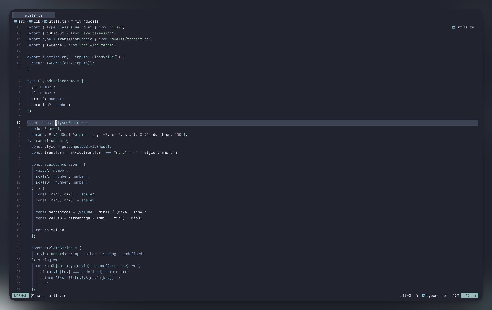

<div align="center">
  <h1>❄ Polar.nvim ❄</h1>
</div>

<div align="center">
  <p>
    Polar is a darker, elegant evolution of the original <a href="https://www.nordtheme.com/">Nord theme</a>.
    <br/>
    A dark theme that invites <em>focus</em>, not attention.
  </p>
</div>

<div align="center">

[](https://neovim.io/)

  
</div>

<br/>

## ✨ Features

- 🌈 Extensive support for `TreeSitter` syntax highlighting
- 🔌 Compatible with popular plugins out of the box
- 🎨 Faithful to the original Nord theme design
- 💅 **Lualine** theme included
- 🖥️ Terminal colors support

### Plugin Support

- [TreeSitter](https://github.com/nvim-treesitter/nvim-treesitter)
- [LSP Diagnostics](https://neovim.io/doc/user/lsp.html)
- [LSP Trouble](https://github.com/folke/lsp-trouble.nvim)
- [Git Graph](https://github.com/isakbm/gitgraph.nvim)
- [Git Signs](https://github.com/lewis6991/gitsigns.nvim)
- [Git Gutter](https://github.com/airblade/vim-gitgutter)
- [Telescope](https://github.com/nvim-telescope/telescope.nvim)
- [NvimTree](https://github.com/kyazdani42/nvim-tree.lua)
- [NeoTree](https://github.com/nvim-neo-tree/neo-tree.nvim)
- [WhichKey](https://github.com/liuchengxu/vim-which-key)
- [Lualine](https://github.com/hoob3rt/lualine.nvim)
- [Leap](https://github.com/ggandor/leap.nvim)
- [Barbar](https://github.com/romgrk/barbar.nvim)
- [Bufferline](https://github.com/akinsho/bufferline.nvim)
- [Cmp](https://github.com/hrsh7th/nvim-cmp/)
- [Navic](https://github.com/SmiteshP/nvim-navic)
- [Aerial](https://github.com/stevearc/aerial.nvim)
- [Notify](https://github.com/rcarriga/nvim-notify)
- [RainbowDelimiter](https://github.com/HiPhish/rainbow-delimiters.nvim)
- [Neogit](https://github.com/NeogitOrg/neogit)
- [highlight-undo.nvim](https://github.com/tzachar/highlight-undo.nvim)
- [Illuminate](https://github.com/RRethy/vim-illuminate)
- [Codeium](https://github.com/Exafunction/codeium.vim)
- [Flash.nvim](https://github.com/folke/flash.nvim)
- [Glance](https://github.com/dnlhc/glance.nvim)
- [Markview](https://github.com/OXY2DEV/markview.nvim)
- [Toggleterm](https://github.com/akinsho/toggleterm.nvim)
- [Blink.cmp](https://github.com/saghen/blink.cmp)
- [fzf-lua](https://github.com/ibhagwan/fzf-lua)
- [Bufferline](https://github.com/akinsho/bufferline.nvim)
- [Snacks](https://github.com/folke/snacks.nvim)

Your preferred plugin is missing? Open an issue or, even better, open a pull request 😉.

## 📦 Installation

Download with your favorite package manager.

```lua
-- Using Lazy
{
  "webhooked/polar.nvim",
  lazy = false,
  priority = 1000,
}

-- Using Packer
use "webhooked/polar.nvim"
```

## 📋 Requirements

- Neovim >= 0.8.0
- Terminal with truecolor support

## 🚀 Usage

As simple as writing:

```vim
colorscheme polar
```

Or in Lua:

```lua
vim.cmd("colorscheme polar")
```

## ⚙️ Configuration

There is no need to call setup if you are ok with the defaults.

```lua
-- Default options:
require("polar").setup({
  -- your configuration comes here
  -- or leave it empty to use the default settings
  transparent = false, -- Enable this to disable setting the background color
  terminal_colors = true, -- Configure the colors used when opening a `:terminal` in Neovim
  diff = { mode = "bg" }, -- enables/disables colorful backgrounds when used in diff mode. values : [bg|fg]
  borders = true, -- Enable the border between verticaly split windows visible
  errors = { mode = "bg" }, -- Display mode for errors and diagnostics
                            -- values : [bg|fg|none]
  search = { theme = "vim" }, -- theme for highlighting search results
                              -- values : [vim|vscode]
  styles = {
    -- Style to be applied to different syntax groups
    -- Value is any valid attr-list value for `:help nvim_set_hl`
    comments = { italic = true },
    keywords = {},
    functions = {},
    variables = {},

    -- To customize lualine/bufferline
    bufferline = {
      current = {},
      modified = { italic = true },
    },

    lualine_bold = false, -- When `true`, section headers in the lualine theme will be bold
  },

  -- colorblind mode
  -- see https://github.com/EdenEast/nightfox.nvim#colorblind
  -- simulation mode has not been implemented yet.
  colorblind = {
    enable = false,
    preserve_background = false,
    severity = {
      protan = 0.0,
      deutan = 0.0,
      tritan = 0.0,
    },
  },

  -- Override the default colors
  ---@param colors Polar.Palette
  on_colors = function(colors) end,

  --- You can override specific highlights to use other groups or a hex color
  --- function will be called with all highlights and the colorScheme table
  ---@param colors Polar.Palette
  on_highlights = function(highlights, colors) end,
})

-- setup must be called before loading
vim.cmd("colorscheme polar")
```

<details>
<summary><strong>💡 Important Notes</strong></summary>

**Configuration:** Make sure to set your configuration **BEFORE** loading the color scheme with `colorscheme polar`.

</details>

## 🤝 Integrations

<details>
<summary><b>nvim-lualine/lualine.nvim</b></summary>
To enable the `polar` theme for `Lualine`, simply specify it in your
lualine settings:

```lua
require('lualine').setup {
  options = {
    -- ... your lualine config
    theme = 'polar'
    -- ... your lualine config
  }
}
```

</details>

<details>
<summary><b>dnlhc/glance.nvim</b></summary>
Polar provide default options for `glance.nvim` to have a better integration:

```lua
require("lazy").setup({
    {
      "dnlhc/glance.nvim",
      opts = require("polar.plugins.glance").make_opts({
        folds = {
          folded = false,
        },
      }),
    }
  }
)
```

</details>

<details>
<summary><b>akinsho/bufferline.nvim</b></summary>
To use this theme for `bufferline`, add this to your config:

```lua
require("bufferline").setup({
    options = {
        separator_style = "thin",
    },
    highlights = require("polar.plugins.bufferline").akinsho(),
})
```

</details>

<details>
<summary>akinsho/toggleterm.nvim</summary>
Polar provide default options for `toggleterm.nvim` to have a better integration:

```lua
require("toggleterm").setup(
    require("polar.plugins.toggleterm").make_opts({
      -- your custom options
    })
)
```

</details>

## 💎 Credits

- [arcticicestudio](https://github.com/arcticicestudio) for the original Nord color palette and themes

## 🙏 Acknowledgements

- [Nord](https://www.nordtheme.com/)
- [arcticicestudio/nord-vim](https://github.com/arcticicestudio/nord-vim)
- [arcticicestudio/nord-visual-studio-code](https://github.com/arcticicestudio/nord-visual-studio-code)
- [gbprod/nord.nvim](https://github.com/gbprod/nord.nvim)
- [shaunsingh/nord.nvim](https://github.com/shaunsingh/nord.nvim)
